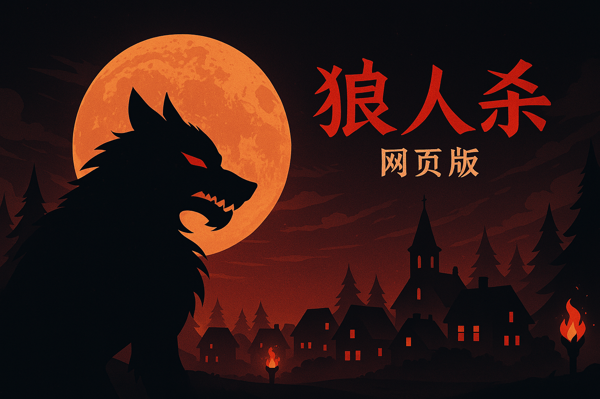

# 🐺 狼人杀网页游戏（Werewolf Web Game）

欢迎体验基于 HTML、CSS 和 JavaScript 编写的狼人杀网页版本！本项目模拟经典的狼人杀桌游流程，包含角色分配、夜晚/白天流程、投票驱逐机制与女巫技能等。



## 🎮 游戏特色

- 🧍 支持最多 **12 名玩家**
- 🌙 **昼夜循环流程**：自动推进夜晚刀人与白天投票
- 🧪 **女巫技能**：可救人或不救，模拟解药机制
- ⚰️ **死亡状态管理**：死亡玩家将标记为已阵亡
- 👻 **恐怖氛围音效**：白天、夜晚与背景音乐自动播放
- 🕹️ **纯前端实现**：无需后端，开箱即用

## 🛠️ 技术栈

- HTML5 + CSS3
- 原生 JavaScript（无框架依赖）
- GitHub Pages 部署支持

## 📦 使用方式

### 1. 本地运行

1. 下载或克隆项目：

```bash
git clone https://github.com/shinyen2010/langrensha-web.git
cd langrensha-web
